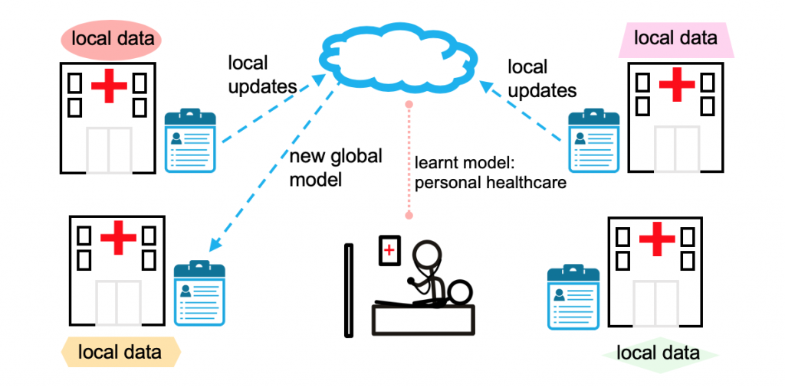

# *🏥Privacy-Preserving Federated Learning for Lung Cancer Detection Using Fog Computing and Multimodal Data*

A novel federated learning framework for lung cancer prediction using CT images and patient metadata. Ensures privacy via:
- ✅ Fog node-based federated architecture
- ✅ Multimodal CNN + FFNN model
- ✅ Generalization + Threshold Shuffler privacy algorithms
- ✅ GAN-based synthetic image generation
- ✅ Adversarial training for robustness
- ✅ Streamlit dashboard for real-time predictions


In today’s digital world, privacy and data security are critical concerns for industries such as healthcare, finance, smart cities, and IoT. Traditional centralized machine learning approaches require collecting data from multiple sources, which can lead to data breaches, high communication costs, and regulatory violations. Federated Learning (FL) allows decentralized model training, but existing FL systems lack strong privacy mechanisms and efficient weight aggregation, making them vulnerable to inference attacks and inefficiencies. 

This project proposes a privacy-preserving Federated Learning framework using Fog Computing, where: 

- Local models are trained on distributed fog nodes (hospitals, banks, smart city sensors, IoT devices).

- Instead of sharing raw data, only processed model weights are sent to the cloud server.

- Generalization & Threshold Shuffler algorithms ensure enhanced privacy before aggregation.



This diagram illustrates the concept of Federated Learning (FL) applied in a lung cancer prediction scenario across multiple hospitals, focusing on privacy-preserving personal healthcare.

Breakdown of the Diagram:
1. Local Data at Hospitals:
Each hospital (represented by buildings with red crosses) holds its own local patient data, including medical records, imaging (e.g., CT scans), and clinical history. This local data never leaves the hospital—a key advantage of federated learning for privacy and data security.

2. Local Updates:
Instead of sending raw patient data to a central server, each hospital trains a local version of a machine learning model (e.g., a model to predict lung cancer risk) on its internal data. They then send only model updates (e.g., weights or gradients) to a central cloud server.

3. Aggregation in the Cloud:
The cloud server collects updates from all participating hospitals and aggregates them to form a new global model. This model now benefits from the diverse and distributed knowledge of all hospitals, while keeping sensitive data private.

4. Shared Global Model:
The new global model is then redistributed back to each hospital. Over several rounds of this process, the model becomes increasingly robust and generalized for tasks such as lung cancer prediction.

5. Personalized Healthcare:
The final, learnt model (as labeled) can be applied to provide personalized healthcare to patients. For example, predicting lung cancer early based on risk factors, imaging data, and patient history without ever exposing private information.

### Demo Video

You can download or watch the demo video below:

[Video](https://github.com/Sangavi0907/FederatedLearning-DP-Lung-Cancer/blob/main/UI_Demo.mp4)


## **Federated Learning for Lung Cancer Prediction: Key Benefits**

🔒 Privacy-Preserving: Patient data never leaves the institution.

🧠 Better Generalization: Model learns from multiple diverse sources.

🏥 Decentralized Training: Useful in medical contexts where data sharing is restricted by laws like HIPAA or GDPR.

🚀 Scalable & Real-Time Updates: Institutions can keep improving their models continuously.


 ## 📁 Folder Structure
- `app.py`: Streamlit UI
- `final_global_model_5.pkl`: Trained federated model
- `multimodal_model.py`: CNN+FFNN code
- `GAN_code.py`: GAN code for Synthetic data generation
- `synthetic_images.npy`: GAN-generated images
- `metrics.json`: Performance metrics with adversarial training
- `FederatedLearning_LungCancerPrediction`: Full source code
- `README.md`: This file


 ## 🚀 Run the Streamlit App
```bash
streamlit run app.py
